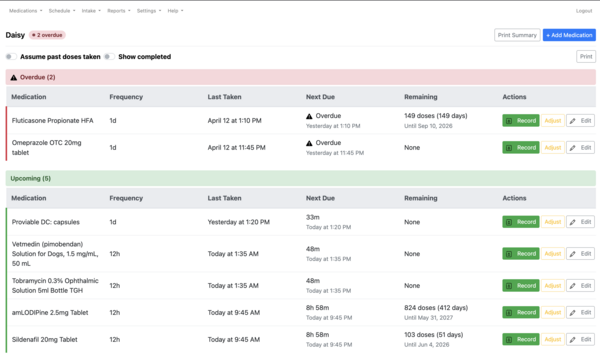
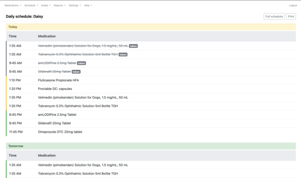
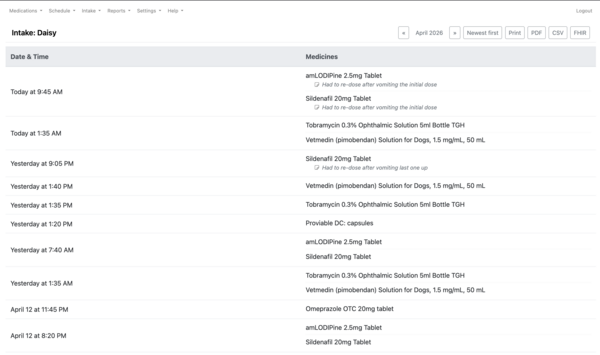
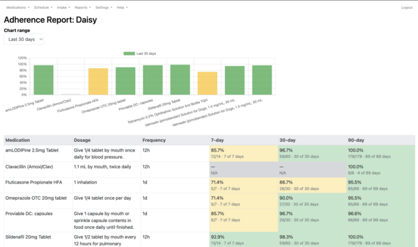

# HomeCare

[](https://github.com/craigk5n/homecare/actions/workflows/tests.yml)
[](https://codecov.io/gh/craigk5n/homecare)
[](https://www.php.net/)
[](LICENSE)

Self-hosted medication tracker for home caregivers. Manages
per-patient schedules, intake history, inventory, and caregiver notes
for one or more dependents — built for the reality that someone is
already juggling multiple medications, refill windows, and "did we
give it this morning?" across a household.

## Screenshots

Click any thumbnail to open the full-resolution image.

| [](docs/screenshots/homecare-list-of-medications.png) | [](docs/screenshots/homecare-todays-schedule.png) |
| :-: | :-: |
| **Patient schedule** — overdue and upcoming groupings with remaining-dose estimates and one-tap record / adjust / edit actions. | **Today and tomorrow** — the daily-driver view with strike-throughs for doses already recorded. |
| [](docs/screenshots/homecare-intake-report.png) | [](docs/screenshots/homecare-adherence-report.png) |
| **Intake history** — month view with inline caregiver notes and CSV / FHIR / PDF export buttons in the sticky header. | **Adherence report** — 7/30/90-day rolling bar chart and table. Gray "N/A" cells distinguish schedules that weren't active in the window from genuine zero-adherence. |

## Features

- **Scheduling** — per-patient medication schedules with arbitrary
  frequencies (`1d`, `12h`, `8h`, `6h`, `4h`). Start and end dates,
  per-schedule dose units, soft-discontinue rather than delete so
  history stays intact.
- **Intake tracking** — one-tap "Record Dose" on a mobile-friendly
  today-view, edit-in-place for corrections, free-text notes per
  intake.
- **Inventory** — current-stock checkpoints and remaining-doses math
  driven by recorded intakes, so "how many days until we run out of
  Sildenafil?" is always available.
- **Reports**
  - *Adherence:* 7/30/90-day rolling percentages plus a custom-range
    view, with partial-schedule handling that distinguishes
    *not-active-in-this-window* from *active-but-zero-adherence*.
  - *Intake history:* month view with inline notes, CSV, HL7 FHIR R4
    (`MedicationAdministration` bundle), and print-ready PDF exports.
  - *Missed medications* and *medication supply* roll-ups.
- **PDF archive** — `generate_monthly_pdf.php` is a cron-friendly CLI
  that renders letter-paper intake reports per patient, per period.
  Accepts arbitrary windows (`--start`/`--end` in `YYYY-MM-DD` or
  `YYYYMMDD`) and writes atomically to an archive directory.
- **Push reminders** — `send_reminders.php` pushes due-soon and
  low-supply alerts to an [ntfy](https://ntfy.sh/) topic.
- **Calendar feed** — `schedule_ics.php` emits an iCalendar feed per
  patient so caregivers can subscribe from their phone's calendar app.
- **API** — small REST surface under `/api/v1/` (patients, schedules,
  intakes, inventory) for integration with home-automation scripts.
- **Auth** — session-based login with bcrypt password storage, remember-me
  cookies, API-key auth for the REST surface, and an audit log of all
  write operations.

## Tech stack

- **PHP 8.1+** with [Composer](https://getcomposer.org/) for the
  namespaced `src/` code. No build step; Apache serves the top-level
  `*.php` files directly.
- **MySQL 8** for production, **SQLite 3.35+** for the integration
  test path.
- **Dompdf** for PDF rendering (vendored — no Composer install needed
  at deploy time).
- **PHPUnit 10** (~300 tests) and **PHPStan at max level** gate every
  pull request.

The infrastructure layer (`includes/init.php`, `includes/dbi4php.php`,
`includes/functions.php`, `includes/translate.php`,
`includes/formvars.php`, `includes/menu.php`, `pub/`) is adopted from
[WebCalendar](https://github.com/craigk5n/webcalendar), which is why
the license below is GPL.

## Quick start (Docker)

```bash
git clone git@github.com:craigk5n/homecare.git
cd homecare
cp .env.example .env                # optional; adjust DB password / TZ
docker compose up --build
```

Open <http://localhost:8080>. On first boot the container loads
`tables-mysql.sql` automatically; subsequent `up` cycles reuse the
named `homecare_db_data` volume.

Seed a starter admin (login `admin`, password `admin` — **rotate on
first login** via Settings → Your Settings):

```bash
docker compose exec db mysql -u homecare -phomecare homecare \
    < migrations/004_seed_admin_user.sql
```

### Services

| Service | Image | Purpose |
| --- | --- | --- |
| `web` | Built from `Dockerfile` (Apache + PHP 8.2) | Application (`8080` → `80`) |
| `db` | `mysql:8.0` | Persistent database, volume `homecare_db_data` |

### Environment variables

The entrypoint writes `includes/settings.php` from these on every
container start.

| Variable | Default | Purpose |
| --- | --- | --- |
| `HC_DB_HOST` | `db` | MySQL host (Compose wires this automatically) |
| `HC_DB_PORT` | `3306` | MySQL port |
| `HC_DB_NAME` | `homecare` | Database name |
| `HC_DB_USER` | `homecare` | DB user |
| `HC_DB_PASSWORD` | required | DB password |
| `HC_DB_TYPE` | `mysqli` | `dbi4php` driver name |
| `HC_TIMEZONE` | `America/New_York` | PHP timezone |

Persistence is held in the `homecare_db_data` volume; wipe it with
`docker compose down -v`.

## Manual install (without Docker)

If you already run Apache + PHP 8.1+ + MySQL 8:

```bash
# Clone into your docroot
git clone git@github.com:craigk5n/homecare.git /var/www/html/homecare

# Load the schema
mysql <your-db> < tables-mysql.sql

# Seed the starter admin user (login: admin / password: admin — rotate
# on first login).
mysql <your-db> < migrations/004_seed_admin_user.sql

# Apply any newer migrations you haven't run yet.
mysql <your-db> < migrations/009_normalize_frequency_2d_to_12h.sql

# Create includes/settings.php with DB credentials (see
# includes/config.php for the expected keys).

# Dompdf is vendored; only run composer if you plan to develop:
#   composer install
```

The application is served directly by Apache — no build, no PHP-FPM
tuning, no Node toolchain.

## Usage highlights

### Cron-driven monthly PDF archive

```cron
# 00:05 on the 1st of each month — archive the month that just ended.
5 0 1 * * cd /var/www/html/homecare && php generate_monthly_pdf.php

# 00:05 on January 1st — annual archive covering the full prior year.
5 0 1 1 * cd /var/www/html/homecare && php generate_monthly_pdf.php \
    --start=$(date -d "last year 01 01" +%Y%m%d) \
    --end=$(date -d "last year 12 31" +%Y%m%d)
```

Set the archive directory once:

```sql
INSERT INTO hc_config (setting, value)
VALUES ('pdf_archive_dir', '/var/backups/homecare/pdf');
```

Or pass `--output-dir=/path` / set `$PDF_ARCHIVE_DIR` for the cron user.
Flags: `--patient-id=N`, `--month=YYYY-MM`, `--start=…`, `--end=…`,
`--dry-run`, `--verbose`, `--help`.

### Due-dose reminders

```cron
# Check every 5 minutes; push any dose due in the next 5 minutes.
*/5 * * * * cd /var/www/html/homecare && php send_reminders.php
```

Configure the ntfy topic through the Settings page (admin) or directly
in `hc_config`.

## Development

```bash
composer install          # installs phpunit + phpstan
composer check            # runs PHPStan (level: max) + the full suite
composer test             # PHPUnit only
composer analyse          # PHPStan only
```

Expectations on contributions:

- PHPStan at `max` stays green.
- Tests are the default; integration tests run against SQLite so the
  suite is ~5 seconds end to end.
- SQL is always parameterised via `dbi_*` (never string-concatenated).
- Output is always HTML-escaped with `htmlspecialchars()`.
- Request input is read via the helpers in `includes/formvars.php`
  (`getGetValue`, `getPostValue`), not raw superglobals.

See [`CLAUDE.md`](CLAUDE.md) for the fuller architecture guide
(request model, module layout, schema, frequency convention,
conventions).

## Project layout

```
├── *.php                  Top-level pages and handlers served by Apache
├── api/v1/                REST API surface
├── docker/                Entrypoint + Apache config for the web image
├── includes/              Bootstrap, DB layer, helpers, menu, CSS
├── migrations/            Non-destructive schema migrations
├── pub/                   Static assets (Bootstrap, Chart.js, icons)
├── src/                   Namespaced HomeCare\ code (PSR-4)
│   ├── Auth/
│   ├── Database/
│   ├── Domain/
│   ├── Export/
│   ├── Repository/
│   ├── Report/
│   └── Service/
├── tables-mysql.sql       Canonical schema
├── tests/                 PHPUnit unit + integration suite
├── vendor/                Vendored runtime deps (Dompdf + friends)
└── send_reminders.php     Cron: due-dose + low-supply notifications
```

## Upgrading PWA assets

Bootstrap, jQuery, and Chart.js are vendored under `pub/` rather than
loaded from a CDN — the app is designed to run on isolated networks
and the service worker (`sw.js`) caches them for offline use. They
are not Composer dependencies, so Dependabot does not track them.
Refresh them manually:

```bash
# Chart.js (used by report_adherence.php)
curl -L -o pub/chart.umd.min.js \
  https://cdn.jsdelivr.net/npm/chart.js@<version>/dist/chart.umd.min.js

# Bootstrap 4 JS + CSS
curl -L -o pub/bootstrap.min.js \
  https://cdn.jsdelivr.net/npm/bootstrap@<version>/dist/js/bootstrap.bundle.min.js
curl -L -o pub/bootstrap.min.css \
  https://cdn.jsdelivr.net/npm/bootstrap@<version>/dist/css/bootstrap.min.css

# jQuery
curl -L -o pub/jquery.min.js \
  https://code.jquery.com/jquery-<version>.min.js
```

After updating any `pub/` asset, bump the cache name in `sw.js`
(e.g. `homecare-shell-v1` → `homecare-shell-v2`) so installed clients
re-fetch instead of serving the stale cached copy.

## Contributing

Issues and pull requests are welcome. Before opening a PR, please:

1. Add or update tests that fail without your change.
2. Run `composer check` locally and confirm it's green.
3. Keep SQL parameterised and output escaped (see the Development
   section).
4. Match commit-message style from `git log` — conventional-commits
   prefixes (`feat:`, `fix:`, `chore:`, `docs:`, etc.).

## Acknowledgements

- [WebCalendar](https://github.com/craigk5n/webcalendar) for the
  `includes/init.php`, `dbi4php.php`, `functions.php`,
  `translate.php`, `formvars.php`, `menu.php`, and `pub/` skeleton.
- [Dompdf](https://github.com/dompdf/dompdf) for PDF rendering.
- [Bootstrap 4](https://getbootstrap.com/) and
  [Chart.js](https://www.chartjs.org/) for the front-end.
- [ntfy](https://ntfy.sh/) for the push-notification transport.

## License

Distributed under the GNU General Public License version 2.0 (or any
later version). See [`LICENSE`](LICENSE) for the full text.
